# **RetailX – Oracle to Databricks Migration (AWS + Databricks Architecture)**

## **Index**

1. [Overview](#-overview)
2. [High-Level Architecture](#-high-level-architecture)
   - [Source – Oracle on AWS EC2](#1-source-aws-ec2--oracle-in-docker)
   - [AWS S3 – Customer Landing Zone](#2-aws-s3--customer-file-landing-zone)
   - [Databricks Components](#3-databricks--unified-ingestion-storage-transformation)
     - Lakeflow Connect
     - Auto Loader
   - [Unity Catalog](#4-unity-catalog--governance-and-lineage)
3. [Medallion Architecture](#5-medallion-architecture-retailx-catalog)
4. [Gold Layer – Delta Live Tables](#-gold-layer--delta-live-tables-dlt)
   - [order_monthly_summary](#1️⃣-retailxgoldordermonthlysummary)
   - [customer_order_profile](#2️⃣-retailxgoldcustomer_order_profile)
5. [Lakebridge Integration](#6-lakebridge-integration-oracle-migration-automation)
   - Analyzer
   - Transpiler
6. [Data Flow Summary](#📊-data-flow-summary)
7. [Technology Stack](#🛠️-technology-stack)

---

## **📌 Overview**

RetailX is migrating operational data from an on-prem Oracle environment running inside AWS EC2 into Databricks using a modern Lakehouse design. The solution integrates **Lakeflow**, **Auto Loader**, **Unity Catalog**, **Delta Live Tables (DLT)**, and **Lakebridge** to deliver a scalable, production-grade pipeline.

---

## **🏗️ High-Level Architecture**


### **1. Source (AWS EC2 + Oracle in Docker)**

- Oracle DB hosted inside a Docker container on EC2.
- Python script extracts data from Oracle.
- Data paths:

  - **Orders → Lakeflow → UC Catalog**
  - **Customers → S3 → Auto Loader**

---

## **2. AWS S3 – Customer File Landing Zone**

- Customer CSV files are uploaded into S3 using Python + Boto3.
- This becomes the streaming ingestion zone for Databricks Auto Loader.

---

## **3. Databricks – Unified Ingestion, Storage, Transformation**

### **A. Lakeflow Connect (For Oracle → Orders Table)**

- Direct ingestion from Oracle to Databricks.
- Writes tables into **`retailx-onprem-catalog.orders`**.
- Exposed to the main catalog through UC views.

### **B. Auto Loader (For Customers → S3 → Databricks)**

- Watches S3 for new CSVs.
- Writes incrementally into Bronze with schema evolution.

---

## **4. Unity Catalog – Governance and Lineage**

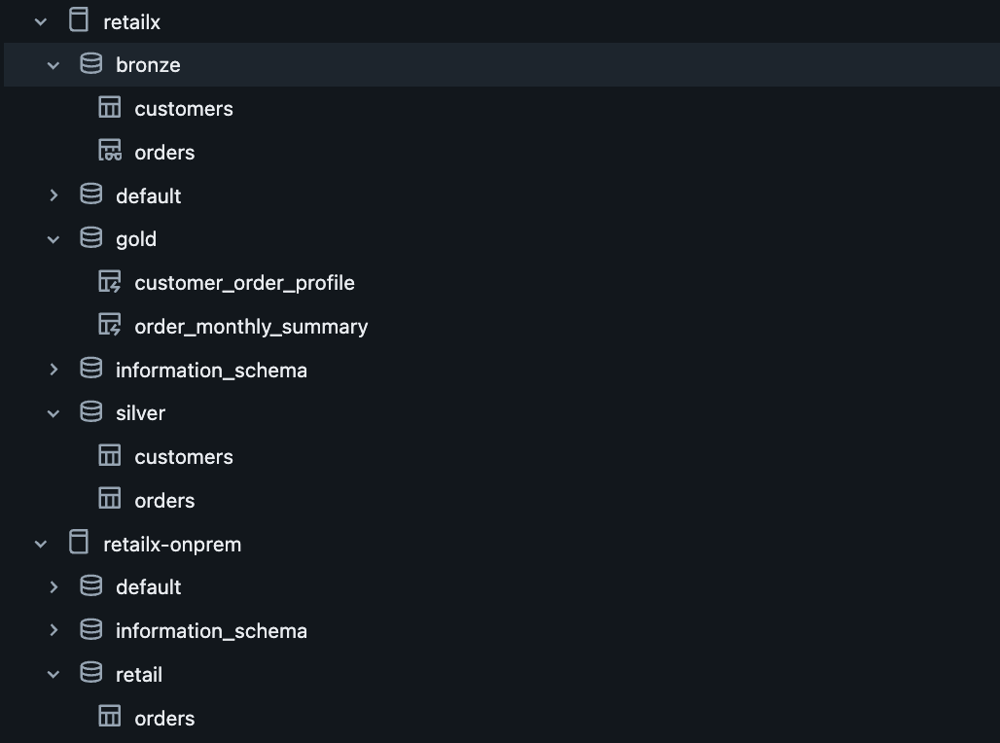

Two catalogs are used:

| Catalog                    | Purpose                                                 |
| -------------------------- | ------------------------------------------------------- |
| **retailx-onprem-catalog** | Contains Lakeflow-synced Oracle tables (e.g.,`orders`). |
| **retailx-catalog**        | Full Medallion pipeline (Bronze, Silver, Gold).         |

UC manages lineage, permissions, and secure access.

---

## **5. Medallion Architecture (retailx-catalog)**

### **Bronze**

- Raw ingested data from Lakeflow and Auto Loader.

### **Silver**

- Type standardization
- Deduplication
- Schema alignment
- Cleaned customer + order datasets

### **Gold**

Business-ready, aggregated, dimensional tables.

---

## **📀 Gold Layer — Delta Live Tables (DLT)**

### **1️⃣ `retailx.gold.order_monthly_summary`**

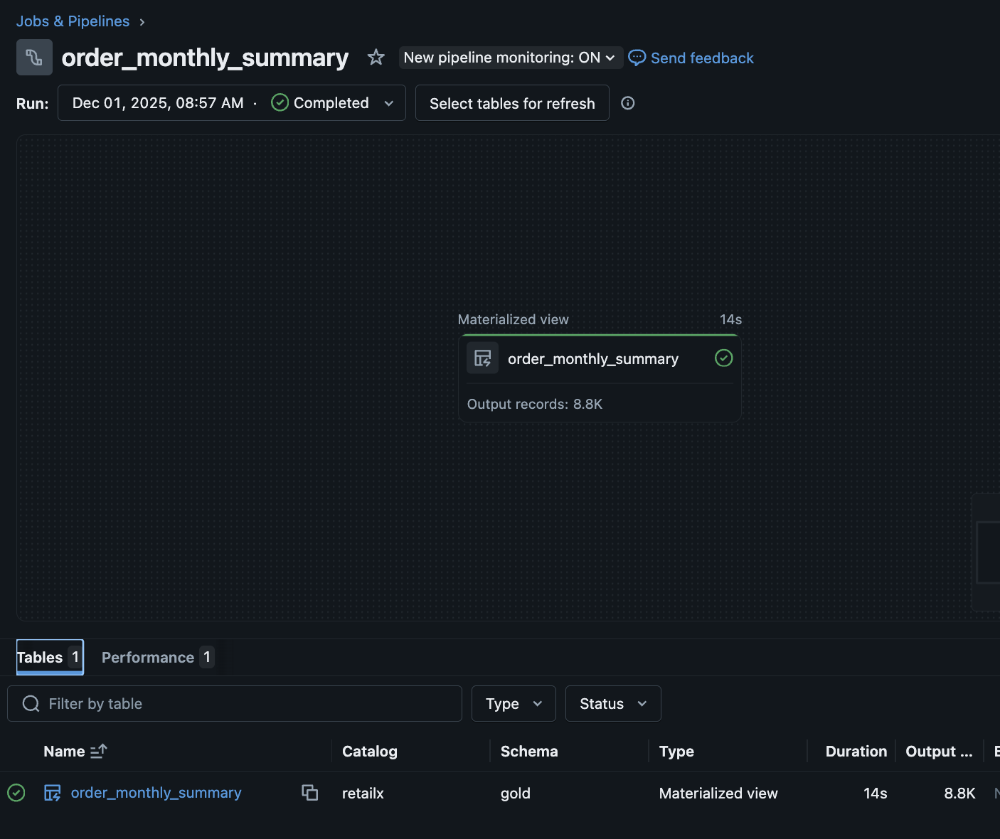
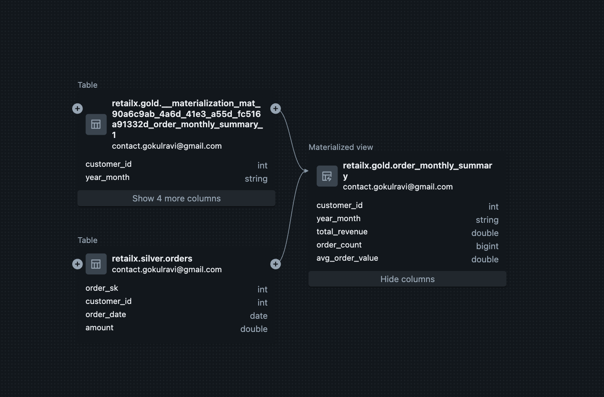

Grain: **customer × month**

Aggregations:

- Total Revenue
- Order Count
- Average Order Value

---

### **2️⃣ `retailx.gold.customer_order_profile`**

Dimension-style enriched customer table with behavioral metrics.

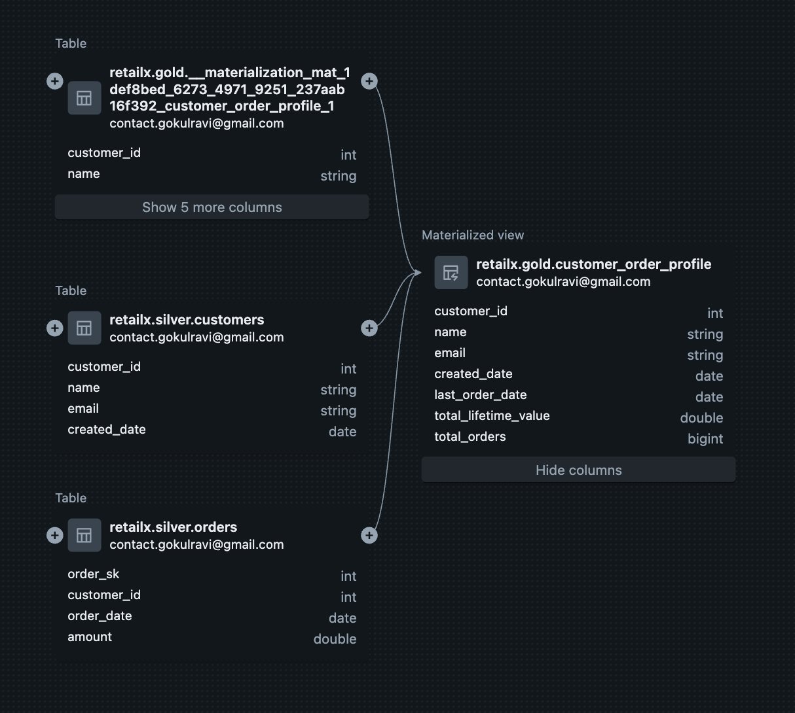
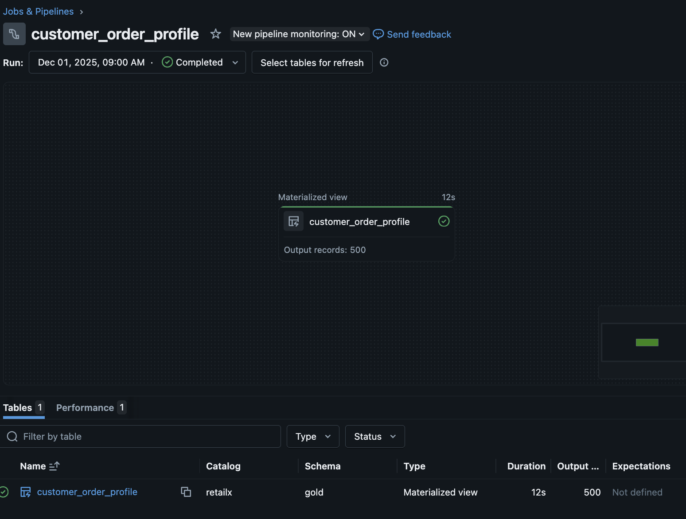

Metrics:

- Last Order Date
- Lifetime Value (LTV)
- Total Orders

---

**These Gold tables serve the core business KPIs: revenue performance, customer LTV, churn analysis, and segmentation.**

---

## **6. Lakebridge Integration (Oracle Migration Automation)**

### **F1. Run Lakebridge Analyzer on Oracle scripts**

- sample_plsql.sql: [sample_plsql.xlsx](lakebridge/input/sample_plsql.xlsx)

  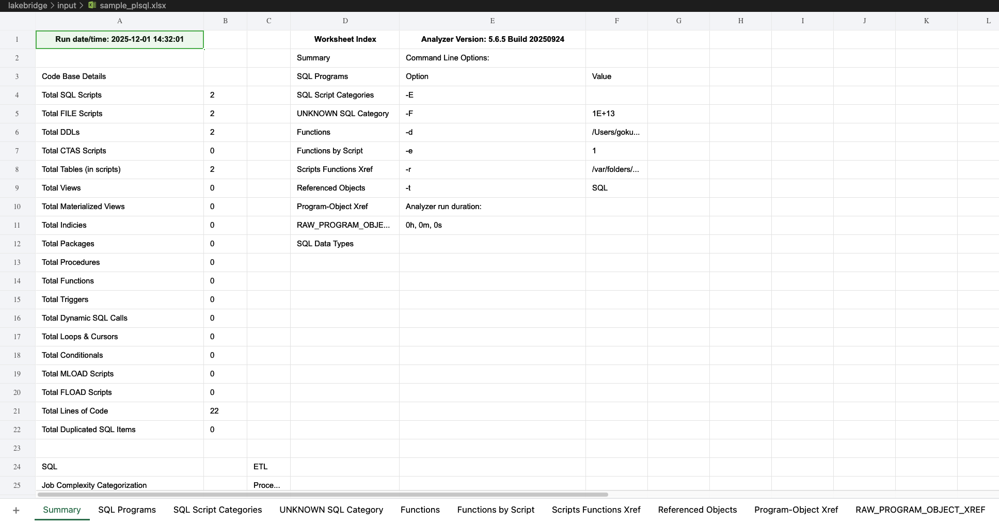

- oracle_plsql:[oracle_schema.xlsx](lakebridge/input/oracle_schema.xlsx)

  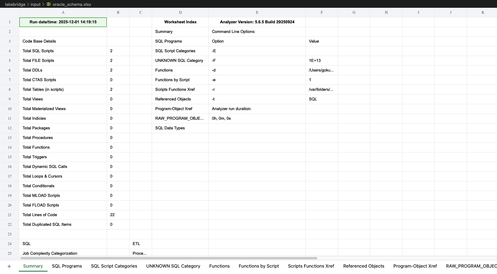

### **F2. Run Lakebridge Transpiler & integrate output**

- #### Before

  - [oracle_schema](lakebridge/input/oracle_schema.sql)
  - [sample_plsql](lakebridge/input/sample_plsql.sql)

  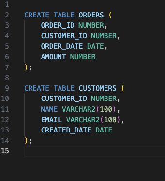
  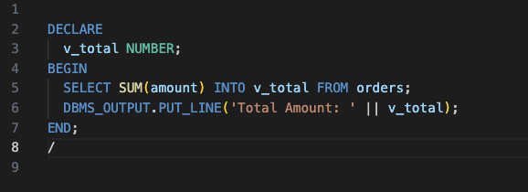

- #### After

  - [oracle_schema](lakebridge/output/oracle_schema.sql)
  - [sample_plsql](lakebridge/output/sample_plsql.sql)

  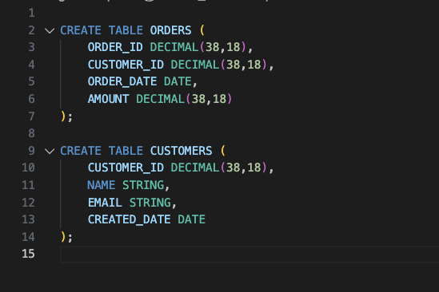
  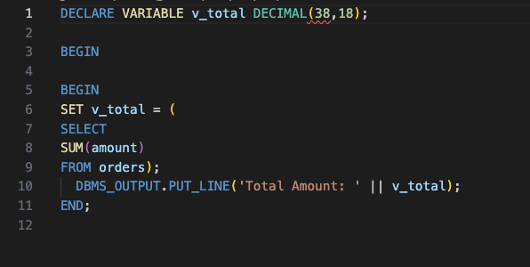

---

## **📊 Data Flow Summary**

### **Orders**

1. Oracle → Python Extraction
2. Lakeflow → `retailx-onprem-catalog.orders`
3. Unity Catalog View → Bronze
4. DLT → Silver → Gold

### **Customers**

1. Python → S3 CSV
2. Auto Loader → Bronze
3. DLT → Silver → Gold

---

## **🛠️ Technology Stack**

| Layer        | Tools                                |
| ------------ | ------------------------------------ |
| Compute      | AWS EC2, Databricks                  |
| Storage      | Amazon S3, Unity Catalog             |
| Source DB    | Oracle (Dockerized)                  |
| Ingestion    | Python, Boto3, Lakeflow, Auto Loader |
| Transform    | Delta Live Tables, PySpark           |
| Migration    | Lakebridge Analyzer + Transpiler     |
| Governance   | Unity Catalog                        |
| Architecture | Medallion (Bronze/Silver/Gold)       |

```

```
