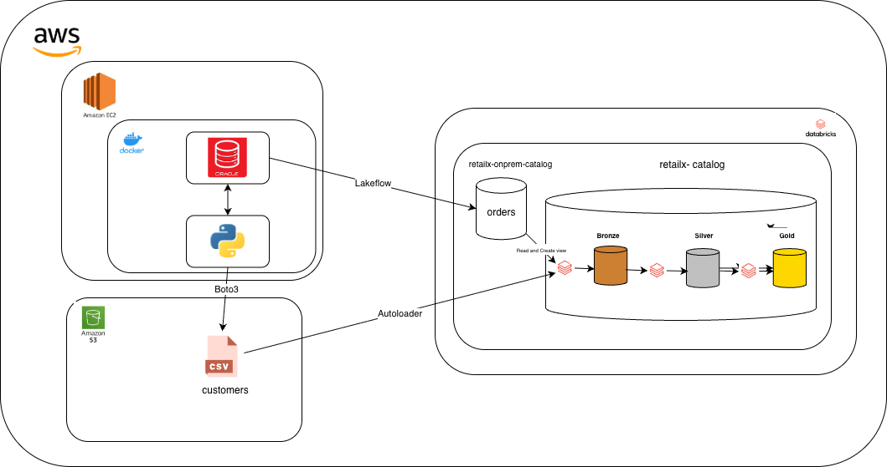

````markdown



# RetailX Oracle to Databricks Migration

## 📖 Objective

Design, build, and operate a scalable data ingestion and transformation pipeline on Databricks to migrate RetailX from Oracle. This project implements a full Medallion Architecture using Databricks best practices, including Unity Catalog, Lakeflow Connect, Auto Loader, Delta Live Tables (DLT), and Lakebridge tools.

## 🏗️ Architecture & Stack

- **Platform:** Databricks Data Intelligence Platform
- **Governance:** Unity Catalog (Metastore, Catalog, Schema, External Locations)
- **Ingestion:** Lakeflow Connect (Oracle), Auto Loader (Files)
- **Processing:** Delta Live Tables (DLT)
- **Migration Tools:** Lakebridge Analyzer & Transpiler

## 🚀 Implementation Details

### A. Unity Catalog Configuration

- **A1:** Setup of Unity Catalog metastore, catalogs, schemas, and external volumes/locations for secure data governance.

### B. Ingestion Layer (Bronze)

- **B1 (Lakeflow Connect):** Ingestion of raw `orders` data directly from source.
- **B2 (Auto Loader):** Scalable ingestion of raw `customers` data using schema evolution and cloud notification services.

### C. Medallion Architecture

- **C1 (Silver Layer):** Transformation logic applied to cleanse raw data, standardize types, and merge datasets.
- **C2 (Gold Layer):** Business-level aggregations, including a Daily Sales Summary table.

### D. Pipeline Orchestration

- **D1:** Full orchestration using **Delta Live Tables (DLT)** for continuous or triggered data processing.

### E. Data Quality & Observability

- **E1:** Implementation of DLT Expectations (Constraints) to handle:
  - Null value checks.
  - Datatype mismatches.
  - Pattern validation.
  - Outlier detection.

### F. Lakebridge Integration

- **F1 (Analyzer):** Assessment of legacy Oracle scripts for compatibility.
- **F2 (Transpiler):** Automated conversion of Oracle SQL to Spark SQL/Databricks SQL and integration into the DLT pipeline.

## 🛠️ How to Run

1.  **Prerequisites:**

    - Databricks Workspace with Unity Catalog enabled.
    - Access to RetailX Oracle source (or mock data).
    - Lakebridge CLI installed.

2.  **Deploy Resources:**

    ```bash
    # Example deployment script
    databricks bundle deploy
    ```

3.  **Execute Pipeline:**
    Navigate to **Workflows -> Delta Live Tables** in the Databricks UI and click **Start**.

## 📊 Data Lineage

This project utilizes Unity Catalog to track lineage from the raw Oracle ingestion points (Bronze) through transformations (Silver) to the final business aggregates (Gold).
````
